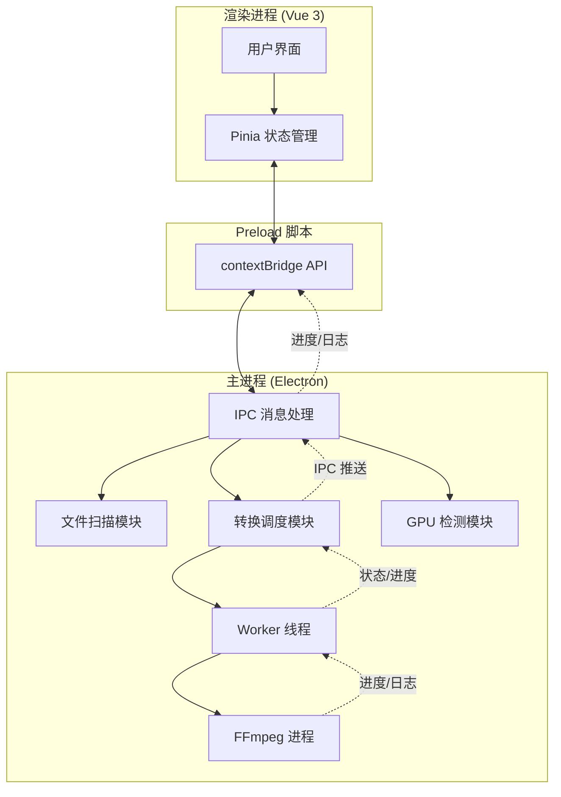

## 产品概述

将现有的视频格式批量转换命令行工具改造为基于 Vue 3 + Electron 的桌面应用，提供精美的图形化界面，让用户通过可视化操作完成视频格式转换，取代原有的命令行交互方式。

## 核心功能

### 1. 目录选择与文件扫描

- 通过系统原生对话框选择视频目录，替代硬编码路径
- 自动扫描目录下所有支持格式的视频文件（.ts, .mkv, .avi, .mov, .wmv, .flv, .webm, .m4v, .mpg, .mpeg, .3gp, .m2ts, .mts）
- 显示文件列表，包含文件名、大小、编码格式、分辨率等信息
- 支持单文件选择和目录选择两种模式
- 支持拖拽文件/文件夹到窗口

### 2. 转换任务管理

- 文件列表支持全选/反选/单选，用户可勾选需要转换的文件
- 一键开始转换，支持批量任务
- 每个文件独立显示转换状态：等待中/转换中/成功/失败
- 支持暂停/继续/取消转换任务
- 并发数量可配置（默认3，保留原有逻辑）

### 3. 实时进度展示

- 单个文件转换进度条（百分比）
- 整体任务进度概览（已完成/总数）
- 预估剩余时间
- 当前转换速度显示

### 4. 编码参数配置

- 预设模式：快速/平衡/高质量，一键切换
- 高级模式：手动调整编码器、质量因子、预设、Profile、Level 等参数
- CUDA 硬件加速开关，自动检测 GPU 支持
- 音频/字幕复制模式切换（直接复制 vs 重新编码）
- 保存自定义配置为预设，下次启动自动加载

### 5. 转换日志

- 实时滚动日志输出，记录每个文件的转换详情
- 日志分级显示：信息/警告/错误
- 支持日志搜索和筛选
- 支持导出日志文件

### 6. 输出设置

- 输出目录配置（默认与源文件同目录，可自定义）
- 转换完成后自动删除原文件开关
- 输出文件名规则（保留原名/添加后缀）
- 同名文件覆盖策略提示

### 7. 系统状态

- FFmpeg 安装状态检测与提示
- GPU 信息展示（显卡型号、CUDA 版本）
- 磁盘剩余空间提示

## 技术栈选择

- **前端框架**: Vue 3 + TypeScript + Vite
- **桌面壳**: Electron（需要文件系统访问、调用 FFmpeg 子进程）
- **UI 组件库**: TDesign Vue Next（企业级设计系统，支持 Vue 3）
- **样式方案**: Tailwind CSS + TDesign 主题定制
- **状态管理**: Pinia
- **构建工具**: Vite + electron-builder
- **进程间通信**: Electron IPC（contextBridge + preload）

## 实现方案

### 架构策略

采用 Electron 标准的双进程架构：

- **主进程（Main Process）**: 负责文件系统操作、FFmpeg 进程管理、Worker 线程调度、系统对话框等原生能力
- **渲染进程（Renderer Process）**: Vue 3 应用，负责 UI 展示和用户交互
- **Preload 脚本**: 通过 contextBridge 暴露安全的 API 给渲染进程，避免直接暴露 Node.js 能力

### 核心改造思路

1. 将现有 `tsToMp4Thread.js` 的目录扫描和任务调度逻辑迁移到 Electron 主进程
2. 将现有 `worker.js` 的 FFmpeg 调用逻辑迁移到 Electron 主进程的 Worker 线程中
3. 通过 IPC 将任务状态、进度、日志实时推送到渲染进程
4. 渲染进程通过 IPC 发送用户操作指令（选择目录、开始转换、暂停、取消等）
5. FFmpeg 进度通过解析 stderr 输出实现实时进度追踪（替代原有 exec 的一次性回调）

### 性能考量

- FFmpeg 进度获取：改用 `spawn` 替代 `exec`，通过监听 stderr 流实时解析进度信息（time=、bitrate=、speed= 等字段）
- 并发控制：保留原有分批并发逻辑，通过可配置的并发数控制资源占用
- 大文件列表渲染：虚拟滚动处理大量文件场景
- IPC 通信节流：进度更新频率控制在 200ms 一次，避免 IPC 消息洪泛

## 实现备注

- FFmpeg stderr 解析进度需处理中文/英文两种输出格式
- Electron 打包时需处理 FFmpeg 路径问题（系统 PATH vs 内置）
- 保留原有 CUDA 加速逻辑，在 GPU 不可用时自动降级为 CPU 编码
- 注意 Windows 路径分隔符处理，统一使用 path 模块

## 架构设计



## 目录结构

```
d:/Program/video-convert/
├── electron/                          # [NEW] Electron 主进程代码
│   ├── main.ts                        # 主进程入口，创建窗口、注册 IPC
│   ├── preload.ts                     # Preload 脚本，暴露安全 API 给渲染进程
│   ├── modules/                       # [NEW] 主进程功能模块
│   │   ├── scanner.ts                 # 文件扫描模块，扫描目录下支持格式的视频文件
│   │   ├── converter.ts               # 转换调度模块，管理任务队列、并发控制、状态推送
│   │   ├── worker.ts                  # Worker 线程逻辑，调用 FFmpeg 执行转换、解析进度
│   │   ├── gpu-detector.ts            # GPU 检测模块，识别显卡型号和 CUDA 支持
│   │   └── ffmpeg-runner.ts           # FFmpeg 进程管理，spawn 调用、stderr 解析进度
│   └── ipc/                           # [NEW] IPC 通信定义
│       └── channels.ts                # IPC 频道常量和消息类型定义
├── src/                               # [NEW] Vue 3 前端代码
│   ├── App.vue                        # 应用根组件
│   ├── main.ts                        # Vue 入口
│   ├── assets/                        # 静态资源
│   ├── components/                    # 通用组件
│   │   ├── FileList.vue               # 文件列表组件，虚拟滚动、勾选、状态展示
│   │   ├── ProgressBar.vue            # 进度条组件，单文件进度和整体进度
│   │   ├── LogPanel.vue               # 日志面板组件，实时滚动、分级、搜索
│   │   └── ParamsEditor.vue           # 参数编辑组件，预设切换和高级配置
│   ├── views/                         # 页面视图
│   │   └── Home.vue                   # 主页面，整合所有功能模块
│   ├── stores/                        # Pinia 状态管理
│   │   ├── files.ts                   # 文件列表状态
│   │   ├── convert.ts                 # 转换任务状态（进度、队列、日志）
│   │   └── settings.ts                # 用户配置状态（编码参数、输出设置）
│   ├── composables/                   # 组合式函数
│   │   └── useElectron.ts             # Electron API 封装，统一 IPC 调用
│   ├── types/                         # TypeScript 类型定义
│   │   └── index.ts                   # 文件信息、转换状态、配置参数等类型
│   └── styles/                        # 全局样式
│       └── global.css                 # Tailwind 引入和自定义样式
├── package.json                       # [MODIFY] 添加 Vue/Electron/TDesign 等依赖和脚本
├── vite.config.ts                     # [NEW] Vite 配置，含 Electron 插件
├── tsconfig.json                      # [NEW] TypeScript 配置
├── tailwind.config.js                 # [NEW] Tailwind CSS 配置
├── electron-builder.yml               # [NEW] Electron 打包配置
├── video/                             # 保留原始脚本（可作参考）
│   └── thread/
│       ├── tsToMp4Thread.js           # [保留] 原始主脚本
│       └── worker.js                  # [保留] 原始 Worker 脚本
└── docs/                              # [NEW] 项目文档
    └── requirements.md                # 需求规划文档
```

## 设计风格

采用深色主题 + 玻璃拟态（Glassmorphism）风格，契合视频/媒体工具的专业氛围。主色调使用科技感蓝紫渐变，搭配半透明毛玻璃面板和微妙的发光效果，营造沉浸式的媒体工作站体验。

## 页面规划

### 主页面（单页应用，左右分栏布局）

**顶部导航栏**

- 应用 Logo + 名称，右上角设置入口和系统状态指示灯（FFmpeg/GPU 状态）

**左侧面板 - 文件管理区**

- 目录选择按钮 + 当前路径显示，支持拖拽目录
- 文件列表：虚拟滚动，每行显示文件名、格式标签、大小、编码、勾选框
- 列表上方：全选/反选/筛选按钮，搜索框
- 底部：文件统计信息（总数/已选数/总大小）

**右侧面板 - 工作区（上下分区）**

- 上部：转换控制面板
- 预设模式切换（快速/平衡/高质量）标签页
- 高级参数折叠面板
- 输出设置行（目录、命名规则、删除原文件开关）
- 开始/暂停/取消按钮组 + 并发数调节
- 下部：进度与日志
- 整体进度条 + 统计数字（成功/失败/进行中）
- 单文件进度列表（仅显示进行中和最近完成的）
- 日志面板：实时滚动，彩色分级（蓝=信息，黄=警告，红=错误）

## 交互细节

- 拖拽文件到窗口时，边框高亮发光提示
- 文件状态变化时平滑过渡动画
- 进度条使用渐变填充 + 流光动画
- 按钮悬停时发光效果
- 转换完成时通知弹窗

## SubAgent

- **code-explorer**: 用于在实现阶段深入探索现有代码的转换逻辑细节（FFmpeg 参数构建、进度解析等），确保迁移时核心功能完整保留且不遗漏边界处理